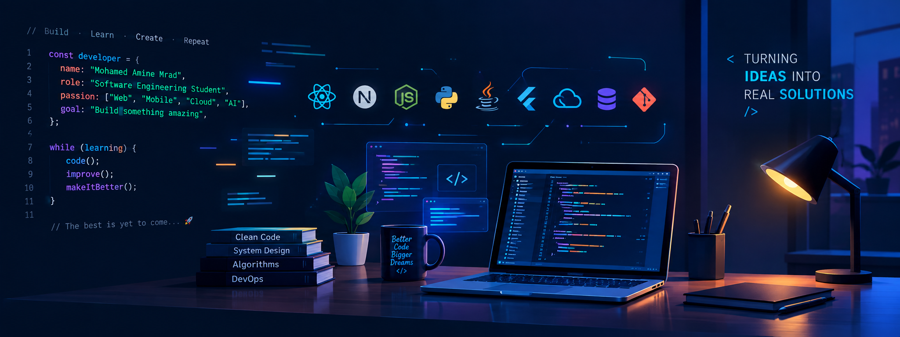

  

<h1 align="center">Hi!, I'm Mohamed Amine Mrad</h1>

<h3 align="center">
Software Engineering Student • Full-Stack Developer
</h3>

  Web • Mobile • Cloud • AI

  🎯 Currently seeking a Final-Year Internship (PFE)

 

  

 

 

  Final-year Software Engineering student at <strong>ITBS</strong>,
  passionate about building modern, scalable and practical software.

  My interests span <strong>Full-Stack Development</strong>,
  <strong>Cloud & DevOps</strong>, and <strong>AI-powered applications</strong>.

 

  

  

  

  

## 💼 Experience

### 🏢 Tunisie Telecom — Full-Stack Development Intern
**Summer 2026 · Nabeul, Tunisia**

Developed a **Vehicle & Mission Management System (VMMS)** with a role-based administration dashboard.

**Key contributions:**

- 👥 Built role-based access for **Admin and Employee**
- 🚗 Developed Employees, Vehicles, and Missions management modules
- 🔐 Implemented authentication and **Row-Level Security (RLS)**
- ⚙️ Built secure server-side API routes
- 📊 Developed reports, statistics, and performance analytics
- 🎨 Designed a consistent interface using **Tailwind CSS**

**Tech:** `Next.js` · `TypeScript` · `Supabase` · `PostgreSQL` · `Tailwind CSS`

  

## 🚀 Featured Projects

### 🌱 Plant-Cure
**AI-Powered Plant Disease Detection & Recommendation System**

A machine-learning application that detects plant diseases from images
and provides AI-generated treatment and prevention recommendations.

**Architecture**

`CNN` → `FastAPI` → `Docker` → `Kubernetes` → `GKE`

**Tech Stack**

`Python` · `TensorFlow/Keras` · `FastAPI` · `Docker` · `Kubernetes` · `GKE Autopilot` · `OpenAI API`

**Highlights**

- 🧠 CNN trained on **38 plant disease classes**
- 📈 Achieved approximately **90% validation accuracy**
- ⚡ Real-time prediction API with FastAPI
- 🤖 AI-generated treatment and prevention recommendations
- 🐳 Containerized frontend, backend, and ML services
- ☸️ Kubernetes deployment with separate environments
- ☁️ Deployed on Google Kubernetes Engine

---

### 🚗 Karhabti
**AI-Assisted Car Marketplace**

A modern full-stack car marketplace combining a complete
shopping experience with AI-powered vehicle image analysis.

**Architecture**

`Next.js` → `API Routes / Server Actions` → `Prisma` → `PostgreSQL`

**Tech Stack**

`Next.js` · `React` · `TypeScript` · `Prisma` · `Supabase` · `PostgreSQL` · `Tailwind CSS` · `Gemini AI`

**Highlights**

- 🚘 Car browsing and marketplace experience
- ❤️ Favorites and test-drive booking
- 🛒 Purchase workflow
- 🔐 Authentication and role-based access
- 🗄️ PostgreSQL database with Prisma ORM
- 🤖 AI-powered image-based vehicle feature extraction
- 🎨 Modern UI with Tailwind CSS / Shadcn UI

---

### 📚 CSFM Library+
**Cross-Platform Library Management Application**

A Flutter-based mobile application for managing library resources,
reservations, loans, and notifications with role-based access control.

**Architecture**

`Flutter` → `Firebase Authentication` → `Cloud Firestore`

**Tech Stack**

`Flutter` · `Dart` · `Firebase Authentication` · `Cloud Firestore`

**Highlights**

- 👥 Role-based access: Admin / Internal Student / External Student
- 🔐 Secure authentication with session persistence
- 🛡️ Firestore security rules for role-based data access
- 🔎 Document search and library management
- 📅 Reservation and loan tracking
- 🔔 Notification management
- 📊 Admin dashboard with usage statistics

---

### 🍽️ SadiBou
**Full-Stack Restaurant Ordering Platform**

A modern restaurant platform for browsing menus,
managing carts, and placing online orders.

**Tech Stack**

`React` · `Node.js` · `Express.js` · `MongoDB Atlas` · `Stripe`

**Highlights**

- 🍴 Menu browsing
- 🛒 Cart & order management
- ⚡ REST APIs
- 💳 Stripe checkout
- 📦 Order management and confirmation

  

## 🛠️ Technical Stack

### 💻 Languages
`JavaScript` · `TypeScript` · `Python` · `Java` · `Dart` · `C#` · `SQL`

### 🌐 Web & Backend
`React.js` · `Next.js` · `Node.js` · `Express.js` · `ASP.NET Core` · `Spring Boot`

### 📱 Mobile
`Flutter`

### 🗄️ Databases
`PostgreSQL` · `MongoDB` · `SQL Server` · `Firebase / Firestore`

### ☁️ Cloud & DevOps
`Docker` · `Kubernetes` · `GKE` · `Git`

### 🤖 AI & Machine Learning
`TensorFlow / Keras` · `FastAPI` · `OpenAI API` · `Gemini AI`

### 🧩 Engineering
`REST APIs` · `Authentication & Authorization` · `Role-Based Access Control`
`RLS` · `SOLID` · `Unit Testing` · `Agile / Scrum`

  

## 🎯 What I'm Looking For

I'm currently seeking a **Final-Year Internship (PFE)** where I can contribute
to real-world software projects and continue growing as a software engineer.

I'm particularly interested in:

- 🚀 Full-Stack Web Development
- ☁️ Cloud & DevOps
- 🤖 AI-powered applications
- 🏗️ Scalable and well-structured software systems

  

## 📊 Most Used Languages

  

  

## 📬 Let's Connect

I'm open to **PFE opportunities, software engineering internships,
and interesting projects**.

  

  

  <strong>Thanks for visiting my profile! 🚀</strong>

